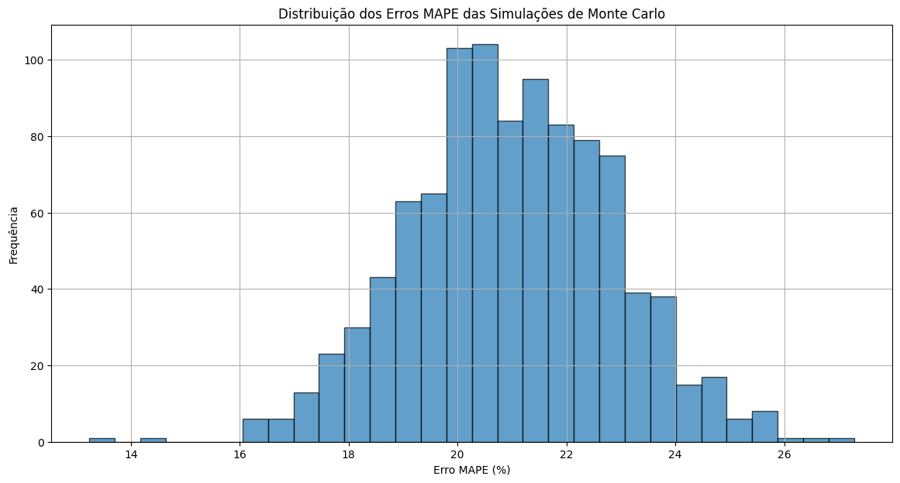

# Análise de Previsão de Preços de Ações com Simulação de Monte Carlo

Este projeto realiza uma análise da previsão de preços de ações usando simulação de Monte Carlo para estimar o erro de previsão. O código utiliza dados históricos das ações da Apple (AAPL) dos últimos dois anos para gerar e avaliar previsões.

## Fonte de Dados

- **Fonte:** Yahoo Finance
- **Biblioteca Utilizada:** [yfinance](https://pypi.org/project/yfinance/)
- **Código da Ação:** AAPL (Apple Inc.)

## Referências

- **Yahoo Finance:**
  - [Website do Yahoo Finance](https://finance.yahoo.com)
- **yfinance Documentation:**
  - [Documentação do yfinance](https://pypi.org/project/yfinance/)
- **Monte Carlo Simulations:**
  - [Simulações de Monte Carlo - Wikipedia](https://pt.wikipedia.org/wiki/Simula%C3%A7%C3%A3o_de_Monte_Carlo)
- **MAPE (Mean Absolute Percentage Error):**
  - [MAPE - Wikipedia](https://en.wikipedia.org/wiki/Mean_absolute_percentage_error)

## Definições e Parâmetros

- **Data de Início:** `2022-09-01`
  - **Descrição:** Data inicial para a coleta dos dados históricos.
  - **Formato:** Ano-Mês-Dia (YYYY-MM-DD)

- **Data Final:** `2024-09-01`
  - **Descrição:** Data final para a coleta dos dados históricos.
  - **Formato:** Ano-Mês-Dia (YYYY-MM-DD)

- **Moeda Utilizada:** USD (Dólar dos Estados Unidos)
  - **Descrição:** Moeda na qual os preços das ações são cotados.

- **Unidade Considerada:** Preço de Fechamento das Ações
  - **Descrição:** Valor final de fechamento das ações da Apple para cada dia de negociação.
  - **Unidade:** Dólares (USD)

- **País:** Estados Unidos
  - **Descrição:** País onde a empresa Apple Inc. está registrada e onde suas ações são negociadas.

## Metodologia

- **Média e Desvio Padrão:**
  - **Média:** Média aritmética dos preços de fechamento das ações da Apple durante o período especificado.
  - **Desvio Padrão:** Medida da dispersão dos preços de fechamento em relação à média, indicando a volatilidade dos preços.

- **Simulação de Monte Carlo:**
  - **Número de Simulações:** 1000
    - **Descrição:** Número de cenários simulados para estimar a variabilidade dos preços futuros com base na média e no desvio padrão calculados.
  - **Período de Previsão:** 30 dias
    - **Descrição:** Período de tempo para o qual os preços futuros foram simulados.

- **Erro MAPE (Mean Absolute Percentage Error):**
  - **Descrição:** Medida do erro percentual médio absoluto entre os preços reais e as previsões simuladas. Utilizado para avaliar a precisão das previsões.

## Caso Exemplo / Simulação

### Exemplo de Simulação

Para ilustrar a aplicação da simulação de Monte Carlo, o código foi executado com os seguintes parâmetros:

- **Data de Início dos Dados:** 01 de setembro de 2022
- **Data Final dos Dados:** 01 de setembro de 2024
- **Número de Simulações:** 1000
- **Período de Previsão:** 30 dias

O modelo gerou 1000 simulações de preços futuros com base na média e no desvio padrão dos preços históricos de fechamento das ações da Apple. A cada simulação, foram comparados os preços simulados com os preços reais dos últimos 30 dias do período de dados.

### Resultados da Simulação

- **Média do Erro MAPE:** 21.23%
  - **Descrição:** O erro percentual médio absoluto calculado para as simulações indica a precisão média das previsões simuladas em relação aos preços reais.

- **Distribuição dos Erros MAPE:**
  - A distribuição dos erros MAPE das simulações é visualizada em um histograma, mostrando a frequência dos diferentes níveis de erro percentual nas previsões.

## Conclusão

O projeto demonstra a utilização de simulação de Monte Carlo para prever preços de ações e avaliar a precisão das previsões com base em dados históricos. A análise dos erros MAPE mostra a variabilidade nas previsões e fornece uma métrica de como o modelo se comporta em termos de erro percentual médio.

As simulações ajudam a entender a incerteza associada às previsões financeiras e são uma ferramenta útil para análise de risco e planejamento.

## Uso

1. **Importe as Bibliotecas:**
   - Instale as bibliotecas necessárias usando `pip install numpy pandas matplotlib yfinance`.

2. **Baixe os Dados:**
   - Execute o script para baixar os dados históricos das ações da Apple.

3. **Análise e Simulação:**
   - O script calcula a média e o desvio padrão dos preços de fechamento e executa simulações de Monte Carlo para prever os preços futuros.

4. **Visualização:**
   - O script plota o preço de fechamento das ações e a distribuição dos erros MAPE das simulações.

